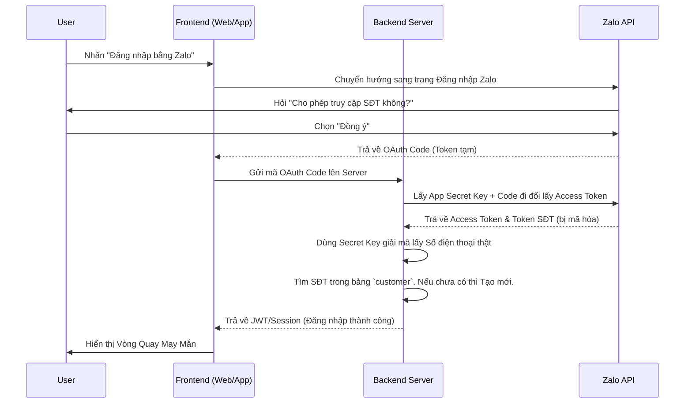

# Hướng dẫn tích hợp Đăng nhập bằng Zalo (Lấy Số Điện Thoại Miễn Phí)

Tài liệu này hướng dẫn chi tiết quy trình triển khai giải pháp xác thực người dùng bằng Zalo Login, giúp hệ thống lấy được Số điện thoại chuẩn của khách hàng với chi phí 0đ mà không cần gửi mã OTP.

---

## 1. Điều kiện tiên quyết (Business Requirements)

Để lấy được Số điện thoại của người dùng qua Zalo, doanh nghiệp bắt buộc phải có:

1.  **Zalo Official Account (OA) có tích vàng:** Nghĩa là OA đã được Zalo xác thực bằng giấy phép kinh doanh của công ty.
2.  **Tài khoản Zalo For Developers:** Đăng nhập bằng tài khoản Zalo cá nhân của lập trình viên hoặc người quản trị.

---

## 2. Các bước thiết lập trên Zalo Developers (Dành cho Admin)

1.  Truy cập trang [Zalo for Developers](https://developers.zalo.me/).
2.  Nhấn **Tạo Ứng Dụng (Create App)** -> Cấp tên cho ứng dụng (VD: *Hệ thống O2O Lucky Draw*).
3.  Vào phần **Quản lý ứng dụng -> Liên kết Official Account**: Liên kết Ứng dụng vừa tạo với cái Zalo OA có tích vàng của công ty.
4.  Vào phần **Cài đặt -> Xét duyệt quyền (Permissions)**:
    - Tìm và xin cấp quyền **`Zalo Account Platform`** (Để lấy thông tin cơ bản: Tên, Avatar).
    - Tìm và xin cấp quyền **`Số điện thoại`** (Cực kỳ quan trọng). Gửi yêu cầu duyệt cho Zalo (Thường Zalo sẽ tự động duyệt nếu OA đã có tích vàng và ứng dụng đã liên kết OA).
5.  Vào phần **Đăng nhập (Login)**: 
    - Nhập `Callback URL` (URL của Website bạn để Zalo trả token về sau khi khách đăng nhập thành công).

> [!IMPORTANT]
> Ghi lại 2 mã số bí mật sau ở trang Tổng quan Ứng dụng: **`App ID`** và **`App Secret Key`**. Chúng ta sẽ cần nó để code ở Backend.

---

## 3. Luồng hoạt động Kỹ thuật (Technical Flow)



---

## 4. Chi tiết Code Tích hợp (Tham khảo)

### Bước 1: Phía Frontend (Website quay thưởng)

Bạn có thể dùng Javascript SDK của Zalo hoặc dùng Link OAuth truyền thống. Dễ nhất là chuyển hướng trình duyệt của khách hàng đến link sau:

```text
https://oauth.zaloapp.com/v4/permission?app_id={APP_ID}&redirect_uri={CALLBACK_URL}&state={MA_BAO_MAT}
```
*Sau khi khách đồng ý, Zalo sẽ chuyển hướng ngược lại về `CALLBACK_URL` kèm theo một cái `code` trên URL: `https://domain.com/callback?code=xxxxxx`.*

### Bước 2: Phía Backend (Server-side)

**1. Đổi `code` lấy `access_token` và `token` chứa số điện thoại:**
Backend gọi API đến Zalo: `POST https://oauth.zaloapp.com/v4/access_token`

**2. Giải mã Token Số điện thoại:**
Zalo KHÔNG trả về số điện thoại dạng chữ thuần (090123...) để bảo mật, mà trả về một chuỗi mã hóa. Backend phải dùng thuật toán AES và **`App Secret Key`** để giải mã chuỗi này.

*(Cấu trúc giải mã chi tiết bạn xem trong [Tài liệu API Zalo: Lấy số điện thoại](https://developers.zalo.me/docs/api/social-api/tai-lieu/lay-so-dien-thoai-nguoi-dung-post-4318))*

**3. Lưu vào Database và cấp Quyền chơi game:**
```sql
-- Đoạn mã giả lập (Pseudocode) cho Logic Backend:
DECLARE @phoneNumber VARCHAR(15) = '0901234567'; -- Lấy từ Zalo sau khi giải mã
DECLARE @customerId BIGINT;

-- 1. Tìm xem khách này có trong DB chưa
SELECT @customerId = customer_id FROM [dbo].[customer] WHERE phone = @phoneNumber;

-- 2. Nếu chưa có -> Tạo mới
IF @customerId IS NULL
BEGIN
    INSERT INTO [dbo].[customer] (phone, ten_khach) VALUES (@phoneNumber, 'Khách từ Zalo');
    SET @customerId = SCOPE_IDENTITY();
END

-- 3. Đăng nhập thành công
-- Trả về Token (JWT) cho Frontend để bắt đầu gọi API quay thưởng.
```

---

## 5. Các lưu ý bảo mật (Security Checklist)

> [!WARNING]
> - **Tuyệt đối không** giải mã Số điện thoại ở dưới Frontend (Javascript). App Secret Key phải được cất giấu kỹ lưỡng ở Backend (trong file `.env`).
> - Mã `code` Zalo trả về chỉ có hiệu lực **1 lần** và sống trong thời gian rất ngắn. Backend phải đổi lấy Access Token ngay lập tức.
> - Luôn sinh một chuỗi ngẫu nhiên gán vào tham số `state` lúc gửi khách sang Zalo, và kiểm tra lại chuỗi `state` này khi Zalo trả về để chống tấn công CSRF.
