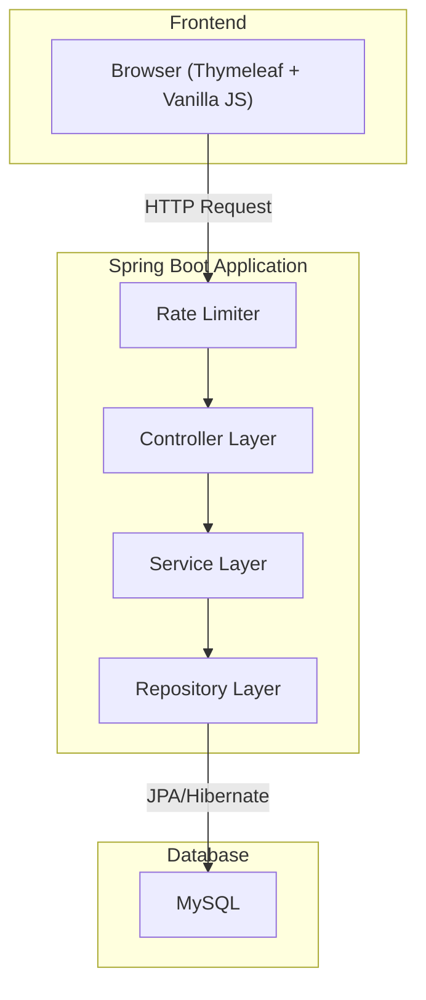
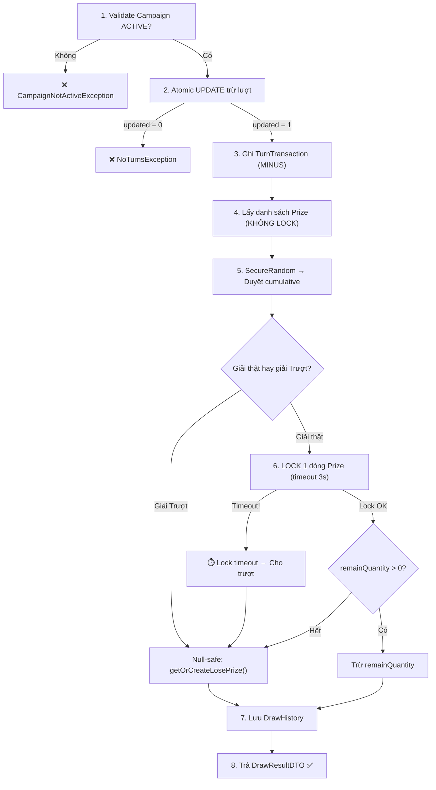

# 🎰 Website Quản lý và Vận hành Chương trình Khuyến mãi May rủi (Bản cải thiện v3)

## Tổng quan

Xây dựng một hệ thống web hoàn chỉnh cho phép **Admin** tạo và quản lý các chương trình khuyến mãi may rủi (quay thưởng), và **User** tham gia quay thưởng, nhận giải thưởng. Hệ thống sử dụng **Spring Boot** (Backend) + **Thymeleaf** (Frontend SSR) + **MySQL** (Database).

> [!NOTE]
> **Bản v3** — Cải thiện dựa trên 3 vòng review:
> - **Vòng 1:** Fix race condition UserTurn, tối ưu lock, bổ sung audit trail, rate limiting, giải "Trượt" mặc định.
> - **Vòng 2:** Fix race condition PromoCode, hard validation xác suất, dashboard tỷ lệ trúng thực tế, đảm bảo rollback transaction.
> - **Vòng 3:** Chống cạn kiệt Connection Pool (lock timeout + tăng pool size), bảo vệ giải Trượt khỏi bị xóa/sửa nhầm (null-safe fallback).

---

## Các quyết định kỹ thuật đã chốt (Technical Decisions)

| # | Quyết định | Lý do |
|---|-----------|-------|
| 1 | **Frontend: Thymeleaf** (SSR) + Vanilla JS/CSS cho hiệu ứng quay | Tích hợp sẵn Spring Boot, giảm độ phức tạp, không cần setup project frontend riêng |
| 2 | **Database: MySQL** | Phổ biến trong hệ sinh thái Java/Spring, đủ mạnh cho bài toán này |
| 3 | **Concurrency: Pessimistic Locking tối ưu** | Chỉ lock **đúng 1 dòng** Prize sau khi random xong, thay vì lock toàn bộ danh sách |
| 4 | **Giải "Trượt" mặc định** | Tổng xác suất luôn = 100%, mọi lượt quay đều trả về 1 Prize (kể cả trượt), code không rẽ nhánh phức tạp |
| 5 | **Atomic UPDATE cho UserTurn & PromoCode** | Tránh race condition khi user spam-click quay **và** khi nhiều user nhập cùng 1 promo code |
| 6 | **SecureRandom** thay cho Math.random() | Chống dự đoán kết quả random |
| 7 | **Rate Limiting** trên API quay | Chống spam request (tối đa 1 request/2 giây/user) |
| 8 | **Hard Validation xác suất ≤ 100%** | Backend chặn cứng khi tổng xác suất giải thật > 100%, ném `ValidationException` ngay lúc Save |
| 9 | **Dashboard tỷ lệ trúng thực tế** | Hiển thị tỷ lệ trúng/trượt thực tế tại thời điểm hiện tại, giúp Admin nạp thêm quà khi cần |
| 10 | **@Transactional rollback an toàn** | Đảm bảo mọi RuntimeException đều rollback toàn bộ (trả lại lượt quay nếu lưu DrawHistory lỗi) |
| 11 | **Lock Timeout + tăng Connection Pool** | Pessimistic Lock tối đa 3 giây, HikariCP pool size = 30-50. Chống sập hệ thống khi quá tải |
| 12 | **Bảo vệ giải Trượt (Null-safe)** | Chặn xóa giải Trượt + fallback giải Trượt ảo trong RAM nếu query trả null |
| 13 | **UI: Minimalist cao cấp** | Sans-serif, wide spacing, tone đơn sắc — phong cách brochure sang trọng phù hợp thương hiệu |
| 14 | **Auth: Spring Security + Session** | Đơn giản, phù hợp Thymeleaf SSR |

---

## Kiến trúc hệ thống



---

## Database Schema (Cải thiện)

> [!IMPORTANT]
> **Thay đổi so với bản cũ:**
> - ✅ Thêm entity **`TURN_TRANSACTION`** — audit trail cho mọi lần cộng/trừ lượt
> - ✅ Thêm entity **`PROMO_CODE`** — quản lý mã khuyến mãi có hệ thống
> - ✅ Thêm **`isWinningPrize`** vào PRIZE — phân biệt giải thật vs giải Trượt
> - ✅ Thêm **UNIQUE constraint** trên USER_TURN(user_id, campaign_id)
> - ✅ Bỏ `isWin` khỏi DRAW_HISTORY — dư thừa vì đã có `prize.isWinningPrize`
> - ✅ `prize_id` trong DRAW_HISTORY **không nullable** — vì trượt cũng có prize_id (giải Trượt)

```mermaid
erDiagram
    USER {
        Long id PK
        String username UK
        String password
        String email
        String phone
        String role "ADMIN hoặc USER"
        Timestamp createdAt
    }

    CAMPAIGN {
        Long id PK
        String name
        Date startDate
        Date endDate
        String status "ACTIVE, PAUSED, ENDED"
        String description
        Timestamp createdAt
    }

    PRIZE {
        Long id PK
        Long campaign_id FK
        String name
        Int totalQuantity
        Int remainQuantity "Giải Trượt: set = -1 (vô hạn)"
        Double probability "% xác suất trúng"
        Boolean isWinningPrize "false = giải Trượt"
    }

    USER_TURN {
        Long id PK
        Long user_id FK
        Long campaign_id FK
        Int remainTurns
        Constraint UK "UNIQUE(user_id, campaign_id)"
    }

    TURN_TRANSACTION {
        Long id PK
        Long user_id FK
        Long campaign_id FK
        String type "ADD hoặc MINUS"
        Int amount
        String sourceReference "Mã đơn hàng, PROMO_CODE, hoặc LUCKY_DRAW"
        Timestamp createdAt
    }

    PROMO_CODE {
        Long id PK
        Long campaign_id FK
        String code UK
        Int turnsGranted "Số lượt quay được cộng"
        Int maxUses "Số lần tối đa sử dụng"
        Int currentUses "Số lần đã dùng"
        Boolean isActive
        Timestamp expiryDate
    }

    DRAW_HISTORY {
        Long id PK
        Long user_id FK
        Long campaign_id FK
        Long prize_id FK "Luôn có giá trị (kể cả trượt)"
        Timestamp drawTime
    }

    USER ||--o{ USER_TURN : has
    USER ||--o{ DRAW_HISTORY : has
    USER ||--o{ TURN_TRANSACTION : makes
    CAMPAIGN ||--o{ PRIZE : contains
    CAMPAIGN ||--o{ USER_TURN : belongs
    CAMPAIGN ||--o{ DRAW_HISTORY : belongs
    CAMPAIGN ||--o{ PROMO_CODE : has
    PRIZE ||--o{ DRAW_HISTORY : awarded_in
```

---

## Cấu trúc thư mục dự kiến (Cập nhật)

```
src/main/java/com/bitis/luckydraw/
├── LuckyDrawApplication.java              # Main class
├── config/
│   ├── SecurityConfig.java                # Spring Security config
│   ├── WebConfig.java                     # Web MVC config
│   └── RateLimitConfig.java               # ⭐ Rate limiting config
├── model/
│   ├── User.java
│   ├── Campaign.java
│   ├── Prize.java                         # ⭐ Thêm isWinningPrize
│   ├── UserTurn.java                      # ⭐ UNIQUE(user_id, campaign_id)
│   ├── TurnTransaction.java              # ⭐ MỚI: Audit trail cộng/trừ lượt
│   ├── PromoCode.java                     # ⭐ MỚI: Quản lý mã khuyến mãi
│   └── DrawHistory.java                   # ⭐ Bỏ isWin, prize_id NOT NULL
├── repository/
│   ├── UserRepository.java
│   ├── CampaignRepository.java
│   ├── PrizeRepository.java               # ⭐ Custom query: findByIdWithPessimisticLock()
│   ├── UserTurnRepository.java            # ⭐ Custom query: decrementTurn() atomic
│   ├── TurnTransactionRepository.java     # ⭐ MỚI
│   ├── PromoCodeRepository.java           # ⭐ incrementUsage() atomic — fix race condition
│   └── DrawHistoryRepository.java
├── service/
│   ├── UserService.java
│   ├── CampaignService.java
│   ├── PrizeService.java                  # ⭐ Hard validation: tổng xác suất giải thật ≤ 100%
│   ├── TurnService.java                   # ⭐ Nạp lượt (admin/promo code) + atomic PromoCode
│   ├── DrawService.java                   # ⭐ Quay thưởng (tối ưu lock + SecureRandom + rollback-safe)
│   └── StatisticsService.java             # ⭐ Tính tỷ lệ trúng thực tế real-time
├── controller/
│   ├── AuthController.java
│   ├── AdminCampaignController.java
│   ├── AdminPrizeController.java
│   ├── AdminTurnController.java           # ⭐ MỚI: Admin cộng lượt cho user
│   ├── AdminPromoCodeController.java      # ⭐ MỚI: CRUD promo code
│   ├── AdminStatisticsController.java     # ⭐ Endpoint tỷ lệ trúng thực tế
│   ├── DrawController.java                # ⭐ Có Rate Limiting
│   └── UserController.java
├── dto/
│   ├── DrawResultDTO.java
│   ├── CampaignDTO.java
│   ├── StatisticsDTO.java
│   └── RealTimeWinRateDTO.java            # ⭐ MỚI: Tỷ lệ trúng thực tế
└── exception/
    ├── GlobalExceptionHandler.java
    ├── NoTurnsException.java
    ├── CampaignNotActiveException.java
    ├── PrizeProbabilityExceededException.java  # ⭐ MỚI: Tổng xác suất > 100%
    └── RateLimitExceededException.java

src/main/resources/
├── application.properties
├── templates/
│   ├── layout/
│   │   └── main.html
│   ├── auth/
│   │   ├── login.html
│   │   └── register.html
│   ├── admin/
│   │   ├── dashboard.html
│   │   ├── campaigns.html
│   │   ├── campaign-form.html
│   │   ├── prizes.html
│   │   ├── promo-codes.html              # ⭐ MỚI
│   │   ├── turn-management.html          # ⭐ MỚI
│   │   └── statistics.html
│   └── user/
│       ├── home.html
│       ├── draw.html
│       ├── redeem.html                    # ⭐ MỚI: Nhập promo code
│       └── history.html
└── static/
    ├── css/
    │   └── style.css
    ├── js/
    │   └── draw.js
    └── images/

src/test/java/com/bitis/luckydraw/
├── service/
│   ├── DrawServiceTest.java
│   └── DrawServiceConcurrencyTest.java    # ⭐ MỚI: Stress test
└── controller/
    └── DrawControllerTest.java
```

---

## Thuật toán quay thưởng (Đã fix & Tối ưu — v3)

> [!IMPORTANT]
> **Các vấn đề đã fix:**
> 1. ❌ Lock toàn bộ danh sách Prize → ✅ Chỉ lock 1 dòng
> 2. ❌ `UserTurn.remainTurns` bị race condition → ✅ Atomic UPDATE
> 3. ❌ `Math.random()` dự đoán được → ✅ `SecureRandom`
> 4. ❌ Lỗi DB giữa chừng → user mất lượt mà không có lịch sử → ✅ `@Transactional` rollback toàn bộ
> 5. ❌ Lock giữ connection quá lâu → cạn kiệt Connection Pool → ✅ Lock timeout 3s + tăng pool size
> 6. ❌ Giải Trượt bị xóa/sửa → NullPointerException → ✅ Null-safe fallback + chặn xóa giải Trượt

```java
// DrawService.java — Bản tối ưu v2
private final SecureRandom secureRandom = new SecureRandom();

// ⭐ [Vấn đề D] @Transactional đảm bảo:
//    - Nếu BẤT KỲ bước nào bên dưới throw RuntimeException → ROLLBACK TOÀN BỘ
//    - User sẽ KHÔNG bị mất lượt khi hệ thống lỗi giữa chừng
//    - Spring mặc định rollback trên RuntimeException (unchecked) — KHÔNG rollback trên checked Exception
//    - Vì tất cả custom exception (NoTurnsException, CampaignNotActiveException...) extend RuntimeException
//      → luôn được rollback đúng
@Transactional(rollbackFor = RuntimeException.class)
public DrawResultDTO draw(Long userId, Long campaignId) {

    // 1. Validate Campaign (không lock)
    Campaign campaign = campaignRepo.findActiveById(campaignId);
    if (campaign == null || !"ACTIVE".equals(campaign.getStatus())) {
        throw new CampaignNotActiveException();
    }

    // 2. ⭐ Trừ lượt bằng Atomic UPDATE — FIX RACE CONDITION
    //    Nếu return 0 → hết lượt → throw NoTurnsException → rollback (nhưng chưa thay đổi gì)
    int updated = userTurnRepo.decrementTurn(userId, campaignId);
    if (updated == 0) throw new NoTurnsException();

    // Ghi log TurnTransaction
    // ⚠️ [Vấn đề D] Nếu các bước phía dưới lỗi → transaction rollback
    //    → dòng TurnTransaction này cũng sẽ bị rollback
    //    → dòng decrementTurn cũng bị rollback → user KHÔNG mất lượt ✅
    TurnTransaction turnTx = new TurnTransaction(userId, campaignId, "MINUS", 1, "LUCKY_DRAW");
    turnTxRepo.save(turnTx);

    // 3. Lấy danh sách giải thưởng (Read bình thường, KHÔNG LOCK)
    List<Prize> prizes = prizeRepo.findByCampaignId(campaignId);

    // 4. ⭐ Random bằng SecureRandom
    double random = secureRandom.nextDouble() * 100; // 0-100
    double cumulative = 0;
    Prize targetPrize = null;

    for (Prize prize : prizes) {
        cumulative += prize.getProbability();
        if (random <= cumulative) {
            targetPrize = prize;
            break;
        }
    }

    // 5. Xử lý kết quả
    Prize finalPrize = targetPrize;

    if (targetPrize != null && targetPrize.getIsWinningPrize()) {
        // ⭐ CHỈ LOCK ĐÚNG 1 DÒNG của giải trúng
        // ⭐ [Vấn đề E] Lock có timeout 3s — nếu quá hạn → catch exception → cho trượt
        //    Tránh giữ connection quá lâu dẫn đến cạn kiệt Connection Pool
        try {
            Prize lockedPrize = prizeRepo.findByIdWithPessimisticLock(targetPrize.getId());

            // Double-check sau khi lock
            if (lockedPrize.getRemainQuantity() > 0) {
                lockedPrize.setRemainQuantity(lockedPrize.getRemainQuantity() - 1);
                prizeRepo.save(lockedPrize);
                finalPrize = lockedPrize;
            } else {
                // Giải vừa hết → Fallback về giải Trượt
                finalPrize = getOrCreateLosePrize(campaignId);
            }
        } catch (PessimisticLockingFailureException | LockTimeoutException e) {
            // ⭐ [Vấn đề E] Lock timeout — cho trượt thay vì giữ connection chờ
            log.warn("Lock timeout cho Prize #{}, cho trượt", targetPrize.getId());
            finalPrize = getOrCreateLosePrize(campaignId);
        }
    }

    // 6. Lưu DrawHistory
    // ⚠️ [Vấn đề D] Nếu lệnh save này lỗi (ví dụ DB rớt mạng)
    //    → RuntimeException → rollback toàn bộ → user được trả lại lượt ✅
    DrawHistory history = new DrawHistory(userId, campaignId, finalPrize.getId(), LocalDateTime.now());
    drawHistoryRepo.save(history);

    // 7. Trả kết quả
    return new DrawResultDTO(finalPrize.getIsWinningPrize(), finalPrize.getName());
}

// ⭐ [Vấn đề F] Null-safe helper: KHÔNG BAO GIỜ trả về null
private Prize getOrCreateLosePrize(Long campaignId) {
    Prize losePrize = prizeRepo.findLosePrizeByCampaignId(campaignId);
    if (losePrize != null) {
        return losePrize;
    }
    // Giải Trượt bị xóa/sửa nhầm → Tạo giải Trượt ảo trong RAM
    // Tuyệt đối KHÔNG để NullPointerException quăng lỗi 500
    log.error("⚠️ CRITICAL: Giải Trượt của Campaign #{} bị mất trong DB! Dùng giải ảo.", campaignId);
    Prize virtualLose = new Prize();
    virtualLose.setId(-1L);  // ID đặc biệt đánh dấu giải ảo
    virtualLose.setName("Chúc bạn may mắn lần sau");
    virtualLose.setIsWinningPrize(false);
    virtualLose.setRemainQuantity(-1);
    virtualLose.setCampaignId(campaignId);
    return virtualLose;
}
```

**Repository query cho Atomic UPDATE:**
```java
// UserTurnRepository.java
@Modifying
@Query("UPDATE UserTurn u SET u.remainTurns = u.remainTurns - 1 " +
       "WHERE u.userId = :userId AND u.campaignId = :campaignId " +
       "AND u.remainTurns > 0")
int decrementTurn(@Param("userId") Long userId, @Param("campaignId") Long campaignId);
// Return 0 = hết lượt, Return 1 = trừ thành công
```

**⭐ [Vấn đề A] Atomic UPDATE cho PromoCode — Fix race condition nhập mã:**
```java
// PromoCodeRepository.java
@Modifying
@Query("UPDATE PromoCode p SET p.currentUses = p.currentUses + 1 " +
       "WHERE p.code = :code AND p.currentUses < p.maxUses " +
       "AND p.isActive = true AND p.expiryDate > CURRENT_TIMESTAMP")
int incrementUsage(@Param("code") String code);
// Return 0 = mã hết lượt/hết hạn/inactive, Return 1 = dùng thành công
```

**⭐ [Vấn đề A] TurnService — Logic nhập promo code an toàn:**
```java
// TurnService.java
@Transactional
public void redeemPromoCode(Long userId, Long campaignId, String code) {
    // 1. Atomic UPDATE — chống race condition khi 100 người nhập cùng lúc
    int updated = promoCodeRepo.incrementUsage(code);
    if (updated == 0) {
        throw new InvalidPromoCodeException("Mã không hợp lệ, đã hết lượt, hoặc hết hạn");
    }

    // 2. Lấy thông tin promo code để biết turnsGranted
    PromoCode promo = promoCodeRepo.findByCode(code);

    // 3. Cộng lượt quay cho user
    userTurnRepo.addTurns(userId, campaignId, promo.getTurnsGranted());

    // 4. Ghi audit trail
    TurnTransaction tx = new TurnTransaction(
        userId, campaignId, "ADD", promo.getTurnsGranted(), "PROMO_CODE:" + code
    );
    turnTxRepo.save(tx);
}
```

**⭐ [Vấn đề B] PrizeService — Hard validation xác suất:**
```java
// PrizeService.java
public void saveOrUpdatePrize(Prize prize) {
    // Tính tổng xác suất các giải THẬT (không tính giải Trượt)
    double totalWinningProb = prizeRepo.findByCampaignId(prize.getCampaignId())
        .stream()
        .filter(p -> p.getIsWinningPrize() && !p.getId().equals(prize.getId()))
        .mapToDouble(Prize::getProbability)
        .sum();

    double newTotal = totalWinningProb + prize.getProbability();

    // ⭐ CHẶN CỨNG: Tổng xác suất giải thật KHÔNG ĐƯỢC > 100%
    if (newTotal > 100.0) {
        throw new PrizeProbabilityExceededException(
            String.format("Tổng xác suất giải thật = %.1f%% (vượt 100%%). " +
                          "Còn trống %.1f%% cho giải mới.",
                          totalWinningProb, 100.0 - totalWinningProb)
        );
    }

    // Lưu giải thật
    prizeRepo.save(prize);

    // Auto cập nhật xác suất giải Trượt = 100% - tổng giải thật
    Prize losePrize = prizeRepo.findLosePrizeByCampaignId(prize.getCampaignId());
    losePrize.setProbability(100.0 - newTotal);
    prizeRepo.save(losePrize);
}
```

**⭐ [Vấn đề C] StatisticsService — Tỷ lệ trúng thực tế real-time:**
```java
// StatisticsService.java
public RealTimeWinRateDTO getRealTimeWinRate(Long campaignId) {
    List<Prize> prizes = prizeRepo.findByCampaignId(campaignId);

    double effectiveWinRate = prizes.stream()
        .filter(p -> p.getIsWinningPrize() && p.getRemainQuantity() > 0)
        .mapToDouble(Prize::getProbability)
        .sum();

    double effectiveLoseRate = 100.0 - effectiveWinRate;

    // Danh sách giải đã hết hàng
    List<String> depletedPrizes = prizes.stream()
        .filter(p -> p.getIsWinningPrize() && p.getRemainQuantity() == 0)
        .map(Prize::getName)
        .toList();

    return new RealTimeWinRateDTO(
        effectiveWinRate,    // % thực tế trúng giải có giá trị
        effectiveLoseRate,   // % thực tế trượt (bao gồm giải hết hàng)
        depletedPrizes       // Danh sách giải đã hết
    );
    // ⚠️ Nếu effectiveLoseRate > 95% → Admin nên nạp thêm quà mới!
}
```

**Repository query cho Pessimistic Lock 1 dòng (có timeout):**
```java
// PrizeRepository.java

// ⭐ [Vấn đề E] Lock timeout 3 giây — tránh giữ connection vô hạn
@Lock(LockModeType.PESSIMISTIC_WRITE)
@QueryHints({@QueryHint(name = "javax.persistence.lock.timeout", value = "3000")})
@Query("SELECT p FROM Prize p WHERE p.id = :id")
Prize findByIdWithPessimisticLock(@Param("id") Long id);

@Query("SELECT p FROM Prize p WHERE p.campaignId = :campaignId AND p.isWinningPrize = false")
Prize findLosePrizeByCampaignId(@Param("campaignId") Long campaignId);
```

**⭐ [Vấn đề E] Cấu hình HikariCP trong `application.properties`:**
```properties
# Connection Pool — Mặc định HikariCP chỉ có 10, quá ít cho hệ thống quay thưởng
spring.datasource.hikari.maximum-pool-size=30
spring.datasource.hikari.minimum-idle=10
spring.datasource.hikari.connection-timeout=5000
# Giới hạn thời gian 1 connection được giữ (tránh leak)
spring.datasource.hikari.max-lifetime=600000
```

**⭐ [Vấn đề F] PrizeService — Chặn xóa giải Trượt:**
```java
// PrizeService.java
public void deletePrize(Long prizeId) {
    Prize prize = prizeRepo.findById(prizeId)
        .orElseThrow(() -> new ResourceNotFoundException("Prize not found"));

    // ⭐ CHẶN CỨNG: Không cho phép xóa giải Trượt
    if (!prize.getIsWinningPrize()) {
        throw new IllegalOperationException(
            "Không thể xóa giải 'Chúc bạn may mắn lần sau'. " +
            "Giải này là bắt buộc cho hệ thống quay thưởng."
        );
    }

    prizeRepo.delete(prize);

    // Auto cập nhật lại xác suất giải Trượt
    double totalWinningProb = prizeRepo.findByCampaignId(prize.getCampaignId())
        .stream()
        .filter(Prize::getIsWinningPrize)
        .mapToDouble(Prize::getProbability)
        .sum();
    Prize losePrize = prizeRepo.findLosePrizeByCampaignId(prize.getCampaignId());
    losePrize.setProbability(100.0 - totalWinningProb);
    prizeRepo.save(losePrize);
}

// Chặn sửa isWinningPrize từ false → true trên giải Trượt
public void saveOrUpdatePrize(Prize prize) {
    // Nếu đang sửa 1 giải đã tồn tại
    if (prize.getId() != null) {
        Prize existing = prizeRepo.findById(prize.getId()).orElse(null);
        if (existing != null && !existing.getIsWinningPrize() && prize.getIsWinningPrize()) {
            throw new IllegalOperationException(
                "Không thể chuyển giải Trượt thành giải thật."
            );
        }
    }
    // ... validation tổng xác suất (code đã có ở trên) ...
}
```

### Luồng xử lý tóm tắt



---

## Lộ trình thực hiện chi tiết (5 Giai đoạn)

### 🔵 Giai đoạn 1: Khởi tạo Project & Database Setup (2-3 ngày)

| # | Nhiệm vụ | Chi tiết |
|---|----------|---------|
| 1.1 | Khởi tạo Spring Boot project | Spring Initializr: Spring Web, Spring Data JPA, MySQL Driver, Spring Security, Thymeleaf, Lombok, Validation |
| 1.2 | Cấu hình `application.properties` | Kết nối MySQL, cấu hình JPA (ddl-auto), server port |
| 1.3 | 🔴 **[E] Cấu hình HikariCP Connection Pool** | `maximum-pool-size=30`, `minimum-idle=10`, `connection-timeout=5000`. Mặc định 10 là **quá ít** cho hệ thống quay thưởng đồng thời |
| 1.4 | Tạo Entity `User` | id, username, password (BCrypt), email, phone, role (ADMIN/USER), createdAt |
| 1.5 | Tạo Entity `Campaign` | id, name, startDate, endDate, status (ACTIVE/PAUSED/ENDED), description, createdAt |
| 1.6 | Tạo Entity `Prize` | id, campaign_id (FK), name, totalQuantity, remainQuantity (-1 = vô hạn), probability, **isWinningPrize** |
| 1.7 | Tạo Entity `UserTurn` | id, user_id (FK), campaign_id (FK), remainTurns. **UNIQUE(user_id, campaign_id)** |
| 1.8 | Tạo Entity `TurnTransaction` | ⭐ **MỚI** — id, user_id, campaign_id, type (ADD/MINUS), amount, sourceReference, createdAt |
| 1.9 | Tạo Entity `PromoCode` | ⭐ **MỚI** — id, campaign_id, code (UK), turnsGranted, maxUses, currentUses, isActive, expiryDate |
| 1.10 | Tạo Entity `DrawHistory` | id, user_id, campaign_id, **prize_id (NOT NULL)**, drawTime. Bỏ isWin |
| 1.11 | Tạo các Repository interfaces | JpaRepository cho mỗi Entity + custom query: `decrementTurn()`, `findByIdWithPessimisticLock()` |
| 1.12 | Cấu hình Spring Security cơ bản | SecurityConfig, login/logout, phân quyền ADMIN/USER, BCrypt encoder |
| 1.13 | Chạy thử & verify DB schema | Đảm bảo Hibernate auto-create tables đúng, kiểm tra constraints |

---

### 🟢 Giai đoạn 2: CRUD Admin — Campaign, Prize, Promo Code & Lượt quay (3-4 ngày)

| # | Nhiệm vụ | Chi tiết |
|---|----------|---------|
| 2.1 | Tạo `CampaignService` | CRUD: tạo, sửa, xóa, tạm dừng campaign |
| 2.2 | Tạo `AdminCampaignController` | GET/POST/PUT/DELETE /admin/campaigns |
| 2.3 | Tạo template `campaigns.html` | Danh sách campaigns dạng bảng, nút Tạo/Sửa/Xóa/Tạm dừng |
| 2.4 | Tạo template `campaign-form.html` | Form tạo/sửa campaign với validation |
| 2.5 | Tạo `PrizeService` | CRUD giải thưởng + **tự động tạo giải "Trượt"** khi tạo campaign |
| 2.6 | 🔴 **[F] Chặn xóa/sửa giải Trượt** | `deletePrize()` từ chối xóa nếu `isWinningPrize = false`. `saveOrUpdatePrize()` chặn đổi giải Trượt thành giải thật. Tránh NullPointerException trong DrawService |
| 2.7 | Tạo `AdminPrizeController` | Quản lý giải thưởng theo campaign |
| 2.8 | Tạo template `prizes.html` | Danh sách giải, cấu hình tỷ lệ trúng. Hiển thị warning nếu tổng ≠ 100%. **Ẩn nút Xóa cho giải Trượt** |
| 2.9 | 🔴 **[B] Hard Validation xác suất** | Backend **chặn cứng** nếu tổng xác suất giải thật > 100% → ném `PrizeProbabilityExceededException`. Auto điều chỉnh giải Trượt = 100% - tổng giải thật |
| 2.10 | ⭐ Tạo `TurnService` | Logic cộng lượt: admin cộng thủ công + user nhập promo code. Ghi log `TurnTransaction` |
| 2.11 | 🔴 **[A] Atomic UPDATE cho PromoCode** | `incrementUsage()` — chống race condition khi nhiều user nhập cùng 1 mã. Dùng `WHERE currentUses < maxUses` |
| 2.12 | ⭐ Tạo `AdminPromoCodeController` | CRUD promo code: tạo mã, set số lượt, giới hạn sử dụng |
| 2.13 | Tạo template `promo-codes.html` | Quản lý promo code cho từng campaign |
| 2.14 | Tạo template `turn-management.html` | Admin xem/cộng lượt quay cho user cụ thể |
| 2.15 | Tạo `Admin Dashboard` | Trang tổng quan admin với navigation |

---

### 🟡 Giai đoạn 3: Core Logic — Thuật toán quay thưởng ⭐ (3-4 ngày)

| # | Nhiệm vụ | Chi tiết |
|---|----------|---------|
| 3.1 | Tạo `DrawService` | Thuật toán quay với **SecureRandom** + cumulative probability |
| 3.2 | ⭐ Implement Atomic UPDATE cho UserTurn | `decrementTurn()` — trừ lượt bằng SQL UPDATE có điều kiện `remainTurns > 0` |
| 3.3 | ⭐ Implement Pessimistic Lock 1 dòng | `findByIdWithPessimisticLock()` — chỉ lock dòng Prize cụ thể sau khi random trúng |
| 3.4 | 🔴 **[E] Lock timeout 3 giây** | Thêm `@QueryHints(lock.timeout = 3000)`. Catch `PessimisticLockingFailureException` → cho trượt thay vì giữ connection chờ vô hạn |
| 3.5 | 🔴 **[F] Null-safe fallback giải Trượt** | Method `getOrCreateLosePrize()` — nếu query trả null → tạo giải Trượt ảo trong RAM, tuyệt đối không để NullPointerException |
| 3.6 | Implement Double-check pattern | Sau khi lock: check `remainQuantity > 0` → nếu hết → fallback giải Trượt |
| 3.7 | Ghi `TurnTransaction` khi trừ lượt | Type = "MINUS", sourceReference = "LUCKY_DRAW" |
| 3.8 | Lưu `DrawHistory` | prize_id luôn NOT NULL (kể cả trượt vì trỏ vào giải Trượt) |
| 3.9 | Tạo `DrawResultDTO` | isWin, prizeName, message |
| 3.10 | ⭐ Implement Rate Limiting | Throttle API quay: tối đa 1 request/2 giây/user (dùng Bucket4j hoặc custom filter) |
| 3.11 | 🔴 **[D] Đảm bảo @Transactional rollback** | Verify tất cả custom exception extend `RuntimeException`. Test rollback: mock DB lỗi ở bước lưu DrawHistory → assert lượt quay được trả lại |
| 3.12 | Viết Unit Test cho `DrawService` | Test cumulative probability, test hết giải → fallback, test hết lượt |
| 3.13 | ⭐ Viết Stress Test concurrency | Multi-threaded test: n thread cùng quay → assert `remainQuantity >= 0` và `remainTurns >= 0` |
| 3.14 | 🔴 **[A] Stress Test PromoCode** | Multi-threaded test: n thread cùng nhập 1 mã có maxUses=5 → assert `currentUses <= 5` |
| 3.15 | 🔴 **[E] Stress Test Connection Pool** | 50+ thread quay cùng lúc → assert không có `ConnectionTimeoutException` |

---

### 🟠 Giai đoạn 4: Giao diện (UI) & Tích hợp API (3-4 ngày)

| # | Nhiệm vụ | Chi tiết |
|---|----------|---------|
| 4.1 | Tạo layout chung `main.html` | Header, footer, navigation. Font sans-serif (Inter/Outfit), wide spacing, tone đơn sắc |
| 4.2 | Tạo `AuthController` + templates | login.html, register.html với validation |
| 4.3 | Tạo `DrawController` REST API | `POST /api/draw/{campaignId}` → trả JSON DrawResultDTO |
| 4.4 | Tạo trang `draw.html` (User) | Giao diện quay thưởng, danh sách giải, số lượt còn lại |
| 4.5 | Tạo `draw.js` — Hiệu ứng quay | Vòng quay tròn / hộp quà bằng CSS Animation + Canvas. Đồng bộ animation với API response |
| 4.6 | ⭐ Tạo trang `redeem.html` (User) | Nhập promo code để nhận lượt quay |
| 4.7 | Tạo trang `history.html` (User) | Lịch sử quay thưởng: ngày, giải trúng/trượt |
| 4.8 | Tạo `UserController` | Trang chủ user, profile, lịch sử |
| 4.9 | Responsive design | CSS responsive cho mobile/tablet |
| 4.10 | Loading states & feedback | Nút quay disabled khi đang xử lý, toast notification kết quả |

---

### 🔴 Giai đoạn 5: Thống kê, Exception Handling & Deploy (3-4 ngày)

| # | Nhiệm vụ | Chi tiết |
|---|----------|---------|
| 5.1 | Tạo `StatisticsService` | Tổng lượt quay, giải đã phát, giải còn lại, top người trúng thưởng |
| 5.2 | Tạo `AdminStatisticsController` | Endpoints thống kê theo campaign |
| 5.3 | Tạo template `statistics.html` | Dashboard thống kê với bảng + biểu đồ (Chart.js) |
| 5.4 | 🔴 **[C] Tỷ lệ trúng thực tế real-time** | API `getRealTimeWinRate()` — hiển thị trên Dashboard: tỷ lệ trúng thực tế, tỷ lệ trượt thực tế, danh sách giải đã hết. **Cảnh báo khi tỷ lệ trượt > 95%** để Admin nạp thêm quà |
| 5.5 | Danh sách trúng thưởng | Bảng danh sách người trúng thưởng cho admin xem |
| 5.6 | ⭐ Bảng tra cứu TurnTransaction | Admin xem lịch sử cộng/trừ lượt của từng user — phục vụ đối soát khiếu nại |
| 5.7 | Error handling toàn diện | `GlobalExceptionHandler`: NoTurnsException, CampaignNotActiveException, RateLimitExceededException, PrizeProbabilityExceededException, InvalidPromoCodeException, **IllegalOperationException**, **PessimisticLockingFailureException** |
| 5.8 | Tối ưu Database | Index cho FK, cột thường query; tối ưu N+1 query với `@EntityGraph` hoặc `JOIN FETCH` |
| 5.9 | Polish UI/UX | Animation mượt, loading states, toast notifications, edge case UX |
| 5.10 | ⭐ Dockerize | Tạo Dockerfile + docker-compose.yml (app + MySQL) để dễ demo |
| 5.10 | ⭐ Tài liệu | README.md hướng dẫn chạy local và deploy |

---

## Verification Plan

### Automated Tests
- ✅ Unit test `DrawService`: test thuật toán cumulative probability với seed cố định
- ✅ Unit test concurrency: multi-threaded test đảm bảo `remainQuantity >= 0` và `remainTurns >= 0`
- ✅ Unit test atomic UPDATE UserTurn: 2 thread cùng trừ lượt cuối cùng → chỉ 1 thành công
- ✅ **[A]** Unit test atomic UPDATE PromoCode: n thread cùng dùng 1 mã (maxUses=5) → assert `currentUses <= 5`
- ✅ **[B]** Test validation xác suất: thử set tổng giải thật = 110% → expect `PrizeProbabilityExceededException`
- ✅ **[D]** Test rollback: mock DB lỗi ở bước lưu DrawHistory → assert `remainTurns` không bị trừ
- ✅ **[E]** Stress Test Connection Pool: 50+ thread quay cùng lúc → assert không có `ConnectionTimeoutException`
- ✅ **[E]** Test Lock Timeout: mock 1 thread giữ lock lâu → thread thứ 2 phải trả về "trượt" sau 3s, không treo
- ✅ **[F]** Test Null-safe fallback: xóa giải Trượt khỏi DB → gọi `draw()` → assert trả về giải ảo, không lỗi 500
- ✅ **[F]** Test chặn xóa giải Trượt: gọi `deletePrize()` trên giải Trượt → expect `IllegalOperationException`
- ✅ Integration test: API endpoint `POST /api/draw/{campaignId}`
- ✅ Test rate limiting: gửi 5 request liên tục → chỉ 1 thành công

### Manual Verification
- Chạy ứng dụng local (`mvn spring-boot:run`)
- Test Admin: tạo campaign → thêm giải thưởng (auto tạo giải Trượt) → **thử nhập tổng xác suất > 100% → phải bị chặn** → **thử xóa giải Trượt → phải bị chặn** → tạo promo code → xem thống kê
- **[C]** Test Admin Dashboard: khi giải hết hàng → Dashboard hiển thị tỷ lệ trượt thực tế tăng + cảnh báo
- Test User: đăng ký → đăng nhập → nhập promo code → quay thưởng → xem lịch sử
- **[A]** Test Promo Code: 2 người cùng nhập mã (maxUses=1) → chỉ 1 người thành công
- **[E]** Test tải cao: mở 30+ tab đồng thời bấm quay → hệ thống không đơ, không lỗi connection
- Test UI: responsive trên mobile, hiệu ứng quay mượt, loading state
- Test edge cases: hết giải → fallback Trượt, hết lượt, campaign hết hạn, spam-click

---

## Ước tính thời gian (Thực tế)

| Giai đoạn | Thời gian |
|-----------|-----------|
| 🔵 GĐ 1: Setup & Entities (7 entity + Security) | 2-3 ngày |
| 🟢 GĐ 2: CRUD Admin + Promo Code + Turn Management | 3-4 ngày |
| 🟡 GĐ 3: DrawService + Rate Limit + Tests | 3-4 ngày |
| 🟠 GĐ 4: UI Thymeleaf + Animation + Responsive | 3-4 ngày |
| 🔴 GĐ 5: Thống kê + Exception + Docker + Docs | 3-4 ngày |
| **Tổng cộng** | **~15-19 ngày** |

> [!NOTE]
> Thời gian đã điều chỉnh thực tế hơn so với bản cũ (10-15 ngày), có tính đến việc debug, test concurrency, và polish UI.

---

## Tổng hợp thay đổi qua các lần review

### Vòng 1: Phân tích bản gốc

| # | Vấn đề | Giải pháp |
|---|--------|----------|
| 1 | 🔴 Race condition trên `UserTurn.remainTurns` | Atomic UPDATE với `WHERE remainTurns > 0` |
| 2 | 🔴 Lock toàn bộ danh sách Prize → bottleneck | Chỉ lock 1 dòng Prize cụ thể sau khi random |
| 3 | 🟡 `Math.random()` dự đoán được | `SecureRandom` |
| 4 | 🟡 Thiếu audit trail cho lượt quay | Thêm entity `TurnTransaction` |
| 5 | 🟡 Thiếu quản lý promo code | Thêm entity `PromoCode` + CRUD |
| 6 | 🟡 Thiếu rate limiting | Rate limiter trên API quay (1 req/2s/user) |
| 7 | 🟡 Thiếu UNIQUE constraint trên UserTurn | `UNIQUE(user_id, campaign_id)` |
| 8 | 🟢 `isWin` trong DrawHistory dư thừa | Bỏ — dùng `prize.isWinningPrize` thay thế |
| 9 | 🟢 `prize_id` nullable khi trượt | NOT NULL — trượt cũng trỏ vào giải Trượt |
| 10 | 🟢 Thời gian ước tính quá lạc quan | Điều chỉnh từ 10-15 → 15-19 ngày |
| 11 | 🟢 Thiếu Deploy plan | Thêm Docker + docker-compose |

### Vòng 2: Rủi ro phát sinh từ bản cải thiện v1

| # | Vấn đề mới | Loại | Giải pháp |
|---|-----------|------|----------|
| A | 🔴 Race condition trên `PromoCode.currentUses` — 100 người nhập cùng 1 mã | Kỹ thuật | Atomic UPDATE: `SET currentUses = currentUses + 1 WHERE currentUses < maxUses` |
| B | 🔴 Admin nhập tổng xác suất giải thật > 100% → giải Trượt bị âm → vỡ logic random | Nghiệp vụ | Hard validation: backend **chặn cứng** khi tổng > 100%, ném `PrizeProbabilityExceededException` |
| C | 🟡 Tỷ lệ trượt thực tế phình to khi các giải hết hàng — Admin không biết | UX/Vận hành | API `getRealTimeWinRate()` hiển thị tỷ lệ trúng/trượt **thực tế** trên Dashboard + cảnh báo khi trượt > 95% |
| D | 🟡 Nếu lưu DrawHistory lỗi → user mất lượt mà không có lịch sử | Kỹ thuật | Đảm bảo `@Transactional` rollback toàn bộ khi `RuntimeException`. Tất cả custom exception phải extend `RuntimeException` |

### Vòng 3: Lỗ hổng Infrastructure & Defensive Programming

| # | Vấn đề mới | Loại | Mức độ | Giải pháp |
|---|-----------|------|--------|----------|
| E | 🔴 **Cạn kiệt Connection Pool** — Pessimistic Lock giữ DB connection, HikariCP mặc định chỉ 10 connection. Khi 10+ thread cùng chờ lock → toàn bộ hệ thống đơ (kể cả Login, Xem lịch sử) | Kỹ thuật | **Cực kỳ nghiêm trọng** | 1) `@QueryHints(lock.timeout = 3000)` — lock tối đa 3s, quá hạn → cho trượt. 2) Tăng `hikari.maximum-pool-size = 30`. 3) Catch `PessimisticLockingFailureException` → fallback trượt thay vì crash |
| F | 🔴 **NullPointerException giải Trượt** — Admin xóa/sửa giải Trượt → `findLosePrizeByCampaignId()` trả null → `finalPrize.getIsWinningPrize()` ném NPE → lỗi 500 cho toàn bộ user | Nghiệp vụ | **Cực kỳ nghiêm trọng** | 1) Chặn cứng xóa giải có `isWinningPrize = false`. 2) Chặn sửa `isWinningPrize` từ false → true. 3) Method `getOrCreateLosePrize()` tạo giải ảo trong RAM nếu query trả null |
